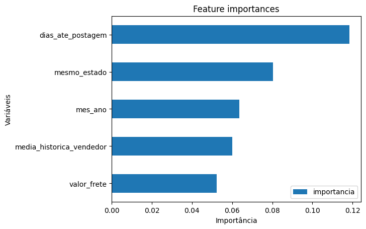
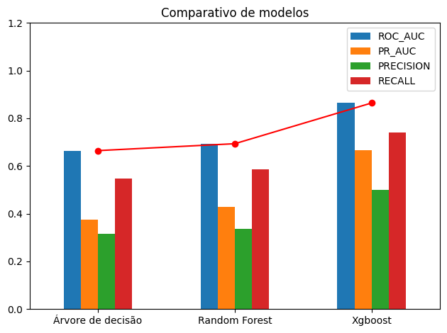
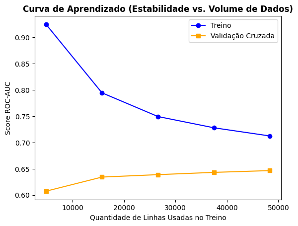
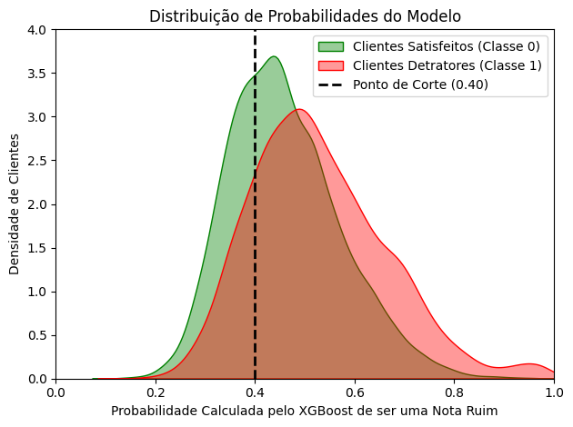
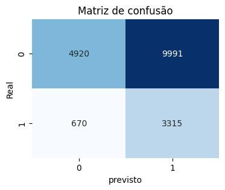

# 📦 Inteligência em CRM Logístico: Previsão Preventiva de Insatisfeitos no E-commerce (Olist)

## 🎯 1. O Desafio de Negócio (Contexto)
Reter um cliente custa até 5 vezes menos do que adquirir um novo. No ecossistema de *marketplaces* como o Olist, experiências de entrega frustrantes geram clientes detratores (avaliações de 1 a 3 estrelas), destruindo o LTV (Lifetime Value) e o NPS da marca.

**A Solução Comercial:** Em vez de atuar de forma reativa após a reclamação ou tentar prever a nota no incerto momento do carrinho de compras, este projeto foi desenhado como uma **Solução de CRM Logístico Preventivo (Batch Processing)**. O modelo roda em lotes diários monitorando a carteira de pedidos no **5º dia pós-venda**. Isso permite espiar os primeiros passos da jornada (se o vendedor atrasou o despacho, gargalos logísticos iniciais e quebras de contrato) para acionar réguas automáticas de relacionamento e suporte prioritário antes mesmo do produto chegar à casa do cliente.

---

## 🛠️ 2. Arquitetura Modular do Projeto
O projeto foi estruturado seguindo as melhores práticas em 3 etapas independentes e encadeadas:

1.  **`coleta_limpeza_eda.ipynb`**: Consolidação e saneamento de 7 tabelas relacionais do Olist. Tratamento rigoroso de duplicidades geradas por múltiplas parcelas ou subitens por pedido para travar a volumetria correta. Limpeza final de registros não avaliados para eliminar ruídos no modelo.
2.  **`eng_atributos_pre_modelagem.ipynb`**: Criação de super munições de negócio baseadas no status do 5º dia do pedido. Tratamento de categóricas via *Dummies* e alinhamento simétrico das partições de treino, validação e teste via técnica de `.reindex`.
3.  **`modelagem.ipynb`**: Treinamento, validação cruzada estruturada (`StratifiedKFold`), otimização de hiperparâmetros (`RandomizedSearchCV`), análise de curvas de aprendizado, distribuição de probabilidades, mapeamento de resíduos (erros) e calibração de *Threshold*.

---

## 🧠 3. Engenharia de Atributos (Status do 5º Dia)
Para simular perfeitamente o ambiente de produção, eliminamos dados do futuro absoluto (como a data de entrega final). No entanto, aproveitando a janela operacional do 5º dia, alimentamos o modelo com variáveis de alto impacto:



*   **Dias até a Postagem:** Cálculo dos dias em que o vendedor postou o produto vs dia da compra.
*   **Logística Geopolítica (`mesmo_estado`):** Mapeamento se o trajeto do pacote exige cruzamento interestadual de malhas rodoviárias ou se flui no principal *hub* logístico do país.
*   **Mês e ano:** o modelo captura a sazonalidade e crescimento da plataforma.
*   **Média Histórica do Vendedor:** com a média acumulada da nota.
*   **Impacto do Frete:** Proporção do custo do frete em relação ao valor total. Fretes proporcionalmente abusivos (>= 30%) tornam o cliente intolerante a pequenos atrasos.

---

## 📊 4. Torneio de Modelos e Resultados Práticos

Avaliamos os modelos utilizando a métrica **ROC-AUC** para estabilidade global e a **PR-AUC (Precision-Recall)** devido ao forte desbalanceamento natural da base (apenas 21% de insatisfeitos na base final tratada). 


| Modelo | ROC-AUC | PR-AUC | Precisão | Recall |
| :--- | :---: | :---: | :---: | :---: |
| **Árvore de Decisão** | 0.66 | 0.37 | 0.32 | 0.55 |
| **Random Forest** | 0.69 | 0.43 | 0.34 | 0.58 |
| **XGBoost (Campeão)** | 0.86 | 0.66 | 0.50 | 0.74 |




Após o tuning e análise da performance do modelo campeão nos dados de validação antes do teste final, o **XGBoost Otimizado** atingiu uma PR-AUC estável de **0.36** na base de validação, ficando muito acima do "chão" aleatório de **0.21**.



o modelo não apresentou que precise de mais dados para melhorar, pois a linha de validação não continua subindo no final do gráfico e o modelo não está sofrendo overfitting, pois as linhas estão próximas (com uma distância menor que 5%), portanto o modelo apresentou estabilidade.


### ⚙️ Calibração de Decisão Comercial (Threshold Tuning)
O modelo padrão (corte 0.50) ignorava a classe rara. Calibrou-se estrategicamente o ponto de corte das probabilidades puras do XGBoost para **0.40** para priorizar o gerenciamento preventivo de crise.


tecnicamente, abriu-se mão do equilíbrio perfeito para garantir que a plataforma interceptasse os insatisfeitos no início da zona de incerteza, aceitando que alguns clientes satisfeitos também fossem interceptados para blindar a imagem da empresa.

Unindo isso a distribuição equilibrada da importância das colunas (eliminando a dominância preguiçosa de variáveis passadas), o modelo **XGBoost** atingiu uma PR-AUC estável de **0.35** no teste blindado, ficando muito acima do "chão" aleatório de **0.21** e um excelente recall de **83%**.


| Métrica | Desempenho na Base de Teste Blindada |
| :--- | :---: |
| **Recall (Sensibilidade)** | **83%** |
| **Precisão** | **25%** |
| **F1-Score** | **0.38** |
| **ROC-AUC Final** | **0.65** |




### 🧩 Análise de Impacto Operacional (Matriz de Confusão)
O corte em 0.40 posicionou o modelo de forma cirúrgica na descida da distribuição de probabilidades dos clientes satisfeitos (montanha verde), assumindo uma taxa controlada de falsos positivos para maximizar a captura da classe detratora (montanha vermelha).

Matriz de Confusão (Teste):



| quantidade | descricao |
| :---: | :--- |
| 4920 | Clientes Satisfeitos Corretos |
| 9991 | Alarmes Falsos |
| 670  | Crises Perdidas |
  3315 | Clientes Detratores Salvos |


**O Retorno Financeiro (ROI):** 
O modelo mostrou sensibilidade e permitiu interceptar **3.315 clientes insatisfeitos antes mesmo de eles receberem o produto**. Para uma estratégia de CRM baseada em canais automatizados de baixíssimo custo marginal (como réguas de e-mail marketing prioritárias, notificações push customizadas ou automações de WhatsApp disparadas via API), o custo de enviar os 13.306 alertas totais é insignificante. O projeto se paga integralmente ao converter potenciais reclamações públicas e cancelamentos em um canal direto de acolhimento e suporte preventivo, blindando a reputação da plataforma.

---

## 🕵️‍♂️ 5. Análise de Resíduos (Onde o Modelo Falha?)
A auditoria minuciosa dos **670 Falsos Negativos** (casos que o modelo deixou escapar) revelou que esses erros concentram-se em pedidos de **ticket médio elevado (R\$ 156,13)** operados por vendedores de **excelente reputação histórica (média de 4.32)**. 

Isso comprova a maturidade do algoritmo: ele preferiu apostar de forma justa no histórico impecável do lojista, falhando predominantemente em capturar imprevistos de força maior das transportadoras (como roubos de carga ou extravios isolados), o que mapeia com exatidão a vulnerabilidade aceitável da solução.

---

## 💾 6. Estrutura do Repositório e Execução
```text
📁 projeto-crm-logistico-olist/
├── 📁 bases/                     
├── 📁 notebooks/                 
│   ├── coleta_limpeza_e_eda.ipynb
│   ├── eng_atributos_pre_modelagem.ipynb
│   └── modelagem.ipynb
├── 📜 .gitignore                          
└── 📜 README.md                  
```

Para reproduzir este projeto, instale as dependências e execute os notebooks respeitando a ordem cronológica.
